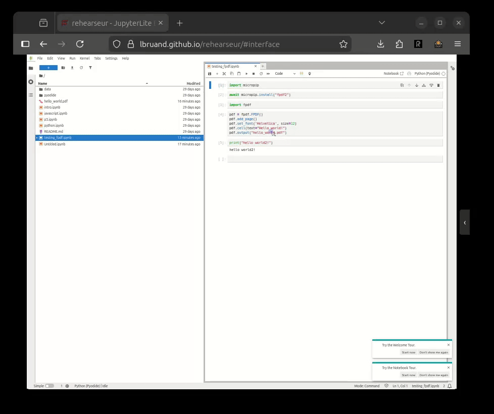

# rehearseur



[Check the demo](https://lbruand.github.io/rehearseur/)

A mix between reprise and cursor :
A React application that replays [rrweb](https://github.com/rrweb-io/rrweb) recordings.

## Features

- Replays rrweb session recordings
  ( you can use for instance for the [rrweb chrome extension](https://github.com/rrweb-io/rrweb/tree/master/packages/web-extension) to record rrweb sessions)
- Supports both raw event arrays and wrapped `{events: [...]}` JSON formats
- Supports gzip-compressed recordings (`.json.gz`)
- Playback controls (play/pause, speed, progress bar)
- Support hierarchical annotation bookmarks to go around the demo quickly
- Keyboard shortcuts for navigation:
  - **Space**: Play/pause toggle
  - **Right Arrow**: Jump to next bookmark and pause
  - **Left Arrow**: Jump to previous bookmark and pause
- URL hash support for deep linking to bookmarks (`#annotation-id`)
- Driver.js integration for annotation overlays with element highlighting

## Getting Started

This project is a video/rrweb/annotation replayer.
You want to create your own project [go to the template project](https://github.com/lbruand/rehearseur-template).

## Contributing

### Install dependencies

```bash
npm install
```

### Run development server

```bash
npm run dev
```

### Build for production

```bash
npm run build
```

## Usage

Place your rrweb recording JSON file in the `public/` directory and update the `recordingUrl` prop in `src/App.tsx`:

```tsx
<RrwebPlayer recordingUrl="/your-recording.json" />
```

## Running Tests

The project includes both TypeScript unit tests and Selenium browser tests.

### TypeScript Unit Tests

Run unit tests for utilities and logic using Vitest:

```bash
npm test              # Run tests in watch mode
npm test -- --run     # Run tests once
npm run test:ui       # Run with UI (requires @vitest/ui)
```

**Test Coverage:**
- `src/utils/parseAnnotations.test.ts` - Annotation markdown parser (23 tests)
  - Frontmatter parsing (version, title)
  - Section parsing with custom/auto IDs
  - Annotation parsing (timestamp, color, autopause, descriptions, driver.js code)
  - Sorting and complex scenarios

### Browser Tests (Selenium)

The project includes Selenium tests for browser automation testing.

#### Prerequisites

```bash
pip install -r tests/requirements.txt
```

#### Running tests with Chromium

```bash
# Start the dev server
npm run dev

# In another terminal, run the tests
pytest tests/test_rrweb_player.py -v
```

### Running tests with Firefox (via Docker)

Firefox tests run in a Docker container to avoid snap compatibility issues:

```bash
# Start the Selenium Firefox container
docker run -d --name selenium-firefox --network host --shm-size=2gb selenium/standalone-firefox:latest

# Run the tests
pytest tests/test_rrweb_player.py -v

# Stop the container when done
docker stop selenium-firefox && docker rm selenium-firefox
```

### Running specific tests

```bash
# Run only the driver.js overlay tests
pytest tests/test_rrweb_player.py::TestDriverJsIntegration -v

# Run a single test
pytest tests/test_rrweb_player.py::TestRrwebPlayer::test_page_loads -v
```

## Tech Stack

- React 19
- TypeScript
- Vite
- Vitest (unit testing)
- rrweb-player
- driver.js (annotation overlays)